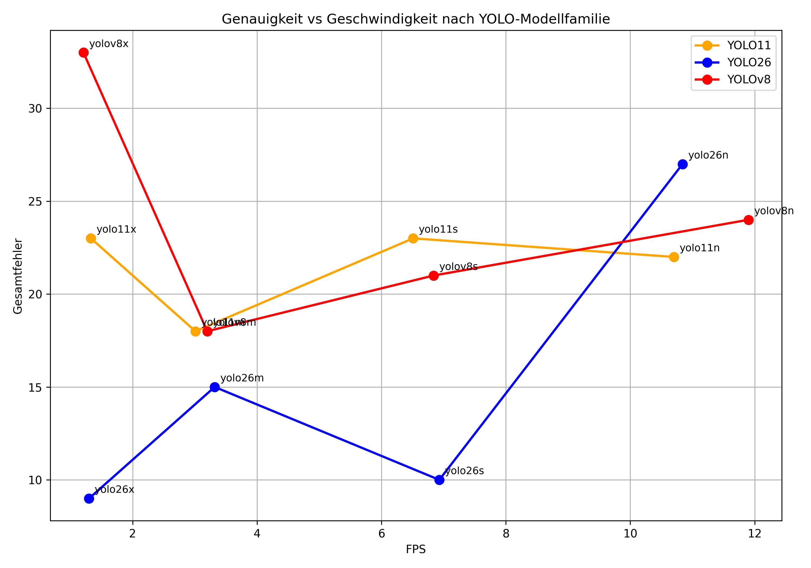

# People Counter - Personen in Videos (mit YOLO)

## Projektbeschreibung

Ziel des Projekts ist die automatische Erkennung, Verfolgung und Zählung von Personen in einem Video. Dazu wird ein Video eingelesen, indem Personen einen Raum betreten oder verlassen. Die Anzahl der Ein- und Ausgänge soll gezählt werden. Die Aufnahme wurde aus der Vogelperspektive aufgenommen.

Zur Personenerkennung werden verschiedene YOLO-Modelle verwendet. Die Personen werden über eine virtuelle, vordefinierte Zähllinie gezählt und die Ergebnisse verschiedener Modellvarianten miteinander verglichen.

## You only look once (YOLO)

YOLO (You Only Look Once) gehört zu den bekanntesten Echtzeitverfahren der Objekterkennung. Das erste YOLO Modell wurde erstmals 2015 eingeführt und von Joseph Redmon und Ali Farhadi entwickelt und dient zur Objekterkennung, Bildsegmentierung und Tracking. Über die Jahre wurden die Modelle immer wieder verbessert und am 14. Januar 2026 wurde das neuste Modell veröffentlicht (YOLO26).


## Verwendete Modelle
### YOLOv8 (veröffentlicht: 2023):
- YOLOv8n
- YOLOv8s
- YOLOv8m
- YOLOv8x
### YOLO11 (veröffentlicht: 2024):
- YOLO11n
- YOLO11s
- YOLO11m
- YOLO11x
### YOLO26 (veröffentlicht: 2026):
- YOLO26n
- YOLO26s
- YOLO26m
- YOLO26x

## Funktionen

- Personenerkennung mit YOLO
- Multi-Object Tracking
- Ein- und Ausgangszählung
- Vergleich mehrerer YOLO-Modelle
- CSV-Export der Ergebnisse
- Erstellung von Diagrammen
- Speicherung der verarbeiteten Videos

## Funktionsweise

### 1. Einlesen des Videos

Das Video wird mit OpenCV eingelesen und Frame für Frame verarbeitet. Für jeden Frame wird anschließend eine Personenerkennung durchgeführt.

### 2. Vorverarbeitung

Vor der Erkennung wird das Bild vorverarbeitet, um auch bei schwierigen Lichtverhältnissen beispielsweise die Genauigkeit zu verbessern. Dabei werden verschiedene Verfahren untersucht:
- Kontrastanpassung
- Helligkeitsanpassung
- CLAHE (Contrast Limited Adaptive Histogram Equalization)
- Bildschärfung (Sharpening)

### 3. Personenerkennung

Zur Personenerkennung werden verschiedene YOLO-Modelle verwendet. YOLO erkennt Personen anhand von Bounding Boxes und weist jeder erkannten Person eine Klasse sowie eine Konfidenz zu.

Für dieses Projekt wird ausschließlich die Klasse "Person" (Class ID = 0) berücksichtigt.

### 4. Tracking

Da dieselbe Person über mehrere Frames hinweg erkannt werden muss, muss ein zusätzliches Tracking-Verfahren eingesetzt werden. Hierfür wird ByteTrack verwendet. Das Tracking weist jeder erkannten Person eine eindeutige ID zu und verfolgt diese über mehrere Frames hinweg. Dadurch kann dieselbe Person von Frame zu Frame wiedererkannt werden.

### 5. Personenzählung

Zur Zählung wird eine virtuelle Linie vordefiniert.

Überschreitet der Mittelpunkt einer Person diese Linie:
- von oben nach unten → Exit
- von unten nach oben → Entry

Jede Tracking-ID wird dabei nur einmal gezählt, um Mehrfachzählungen zu vermeiden.

### 6. Auswertung

Für jedes Modell werden folgende Kennzahlen bestimmt:

- Anzahl der Eintritte (Entry)
- Anzahl der Austritte (Exit)
- Fehler gegenüber der Ground Truth
- Verarbeitungsgeschwindigkeit (FPS)

Die Ergebnisse werden anschließend in einer CSV-Datei gespeichert und grafisch ausgewertet.

## Datensatz

Verwendet wurde das Video:
```text
input_videos/video4.mp4
```
## Projektstruktur
```
people-detection/
│
├── assets/
│   └── images/
│
├── input_videos/
│   └── video4.mp4
│
├── output/
│   └── model_comparison/
│
├── src/
│   ├── people_counter.py
│   └── plot_results.py
│
├── requirements.txt
└── README.md
```
## YOLO Models
Die YOLO-Modelle sind noch nicht in diesem Repository enthalten, auf Grund der Größe. Beim ersten Mal ausführen des Codes werden die benötigten Modelle automatisch heruntergeladen.

## Installation
```text
pip install -r requirements.txt
```

## Bewertungsmetriken:
- Entry Count: erkannte Eintritte
- Exit Count: erkannte Austritte
- Entry Error: Abweichung zur Ground Truth
- Exit Error: Abweichung zur Ground Truth
- Total Error: Summe aus Entry- und Exit-Fehler
- Processing FPS: Verarbeitungsgeschwindigkeit

## Ergebnisse:
Die Modelle werden hinsichtlich
- Erkennungsgenauigkeit
- Zählgenauigkeit
- Verarbeitungsgeschwindigkeit 

miteinander verglichen. Die Auswertung erfolgt anhand der erzeugten CSV-Datei sowie verschiedener Diagramme.
## Auswertung der Modelle:


## YOLO_Modelle Auswertung von Ultralytics:


## Vergleich
Sowohl die eigenen Messergebnisse als auch die Benchmark-Daten von Ultralytics zeigen den gleichen grundlegenden Zusammenhang: Größere Modelle liefern eine höhere Genauigkeit, benötigen jedoch mehr Rechenleistung und erreichen daher geringere FPS.

Darüber hinaus zeigen die veröffentlichten Benchmarks, dass die YOLO26-Modelle im Vergleich zu früheren Modellgenerationen eine bessere Genauigkeit bei ähnlicher Verarbeitungsgeschwindigkeit erzielen.

## Probleme: 
- Personen werden teilweise nicht oder schlecht erkannt und getracked
YOLO-Modelle werden mit großen Datensätzen für allgemeine Objekterkennung trainiert (Menschen, Tiere, Fahrzeuge...)
-> Modell mit spezialisierten Datensatz trainieren
- Videoqualität (geringe Auflösung, Wasserzeichen, schlechte Lichtverhältnisse beeinflussen die Erkennung) 
- Verdeckungen oder dicht beeinander laufende Personen kann es zu Fehler beim Tracking oder Zählungen kommen
- Preprocessing kann die Erkennung verbssern, aber auch bestimmte Artefakte verschlimmern

## Authors
- Tan Loc Huschka (@taniiboy)
- Alexander Korolev (@AlexKoro186)
